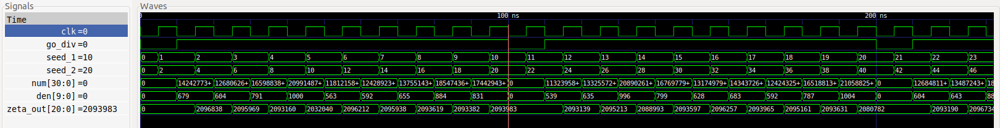
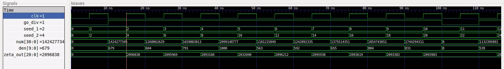
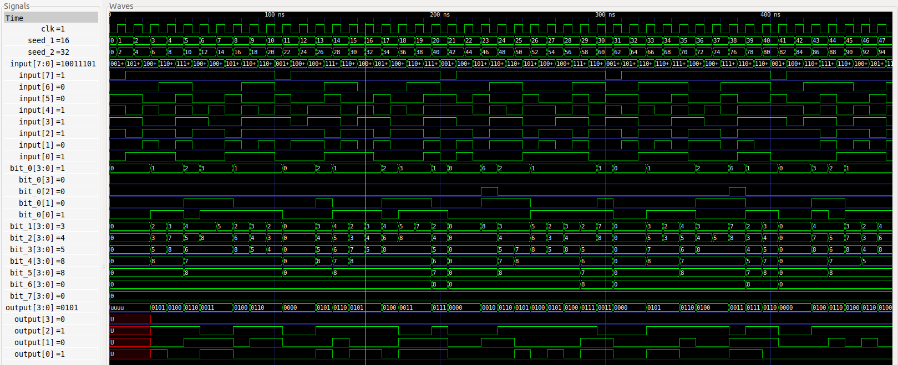
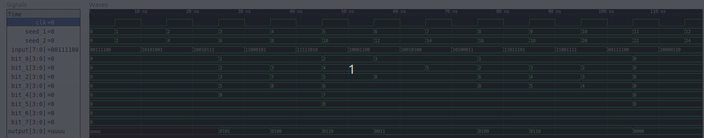

# Software and computing project

## Proposal of the repository

In this frame work I present a part my master degree thesis work and reaserch. The proposed codes are sub-sets of a more complex hardware design which with the brightest expectations will be installed in the Trigger DAQ-chain of the ATLAS' tracker for the Phase-II upgrade. My aim is to provide the sources of this codes, a valid test of the effective functionality of the codes itself and their key role in the whole project development.

#### VHDL brief introduction
VHDL, or better VHSIC-HDL (Very High Speed Integrated Circuit Hardware Description Language), is a hardware description language, used in electronic design automatation to describe digital and mixed signal systems such as FPGAs (Field Programmable Gate Arrays) and ASICs (Application Specific Integrated Circuits). 

A VHDL project development is divided into 4 phases:

- *Register Transfer Level (RTL)*: i.e. the source codes which, through the libraries provided by the language, includes the "built"  electronic circuit of interest (so called Architecture);
- *Simulation*: test of the built circuit by setting the input signals and studying the output ones (this part is still done in software);
- *Synthesis*: creation of the logic scheme and instantiation of the for a generic FPGA (not specific one) and creation of a list of needed components to be implemented (Netlist);
- *Implementation*: physical implementation of the type and number of components on a real FPGA (of course different FPGAs have different features). 
The last two parts of the project development may be done only if a physical hardware is present, maybe even with more sofisticated programs. I am currently learning how to develop complete hardware designs in [Vivado](https://www.xilinx.com/products/design-tools/vivado.html), but since it is required a licence and specially the program size is quite huge, only the first two steps will be developed with a free and easy-to-handle tool.

#### GHDL installation and compiler 
There are many free compiler you can find online, but to execute the codes in this repository I suggest to use GHDL, which suits perfectly for the pourposes of this project. Beware, this software in not able to provide a Synthesis phase (thus no netlist will be produced).
In any case, here is a simple tutorial to install and compile in GHDL.
From your power shell type the following lines to install and to clone the [GHDL](https://github.com/ghdl/ghdl) repository:
```
sudo apt update
sudo apt install -y git make gnat zlib1g-dev
git clone https://github.com/ghdl/ghdl
cd ghdl
./configure --prefix=/usr/local
make
sudo make install
```
This commands should work on Unix systems (I personally use Ubuntu 18.04.4 and it works), but for additional notes ad hints on installation please check the [GHDL-install](http://ghdl.free.fr/site/pmwiki.php?n=Main.Installation) site.
Moreover, GHDL does not provide any graphical displayer, so to display the signal of the source code and of the test bench you can install another free software for graphical visualization of the electronic signals [GKTwave](http://gtkwave.sourceforge.net/):```sudo apt-get install gtkwave```
So far, if everything has been done correctly, you should now be able to used all the needed tools.
In GHDL many commands are available, for instance:

- ```ghdl -s``` makes a syntax check of the files (do it if you are beginners, it will help you a lot);
- ```ghdl -a``` analyze the files;
- ```ghdl -e``` elaborate the defined units in the files (Architecture);
- ```ghdl -r``` runs the files, generating a waveform file which can be displayed.

These the most basilar commands to use, for deeper details for the various compiling options you can type from the shell the option ```ghdl --help```.
The following lines are a simple example on how to check, analyze, execute and run the files and eventually display them in the GTKwave software: 
```
cd ~/path/to/the/repository/
ghdl -a library.vhd
ghdl -a divider.vhd
ghdl -a divider_test_bench.vhd
ghdl -e divider_test_bench 
ghdl -r divider_test_bench --vcd=divider.vcd --disp-time
gtkwave divider.vcd
```
In general every sub-respository has a library to compile, a source and a test_bench file. The source files emmbed the **Architecture**, i.e. the main circuit that has to be simulated, synthetized and eventually implemented on a physical hardware device. The simulation part is presented in the test bench files.

## The architectures

In this paragraph I will briefly describe the main features of the built architectures. Both of them have been tested in their folders respectively, and to change the behaviour of the simulation you can edit the *test_bench.vhd* files (maybe start by changing some parameters and if you get in touch with the languge try to build other possible simulations).

The presented codes as anticipated are a part of a wider project for the new upgrades of the ATLAS hrrdware trigger system. The need of this sub-parts comes from the implemented algorithm for the track reconstruction: the [Hough Transform](https://en.wikipedia.org/wiki/Hough_transform). It is nothing new from the algorithmic part, since this transform is already hugely used in software developments for lines detection, but no one since now has implemented it on FPGAs at a high level performance. 

In order to do so, the sub-parts I present in the following sections have a key role in the whole project.
### divider.vhd

As the name of the file states, this Architecture performs the binary division of two numbers (always remember that in VHDL everything is a **binary** number, and it behaves as so). Nothing complicated in maths, despite the conversion in VHDL codes is a little bit tricky. Now, the main idea of this program is that giving as input a numerator (31 bits) and a denominator (10 bits) gives as output the result of the division (20 bits, comes from the rules of operations with binary numbers). The result thus could possibly reach its limit, but the expected data input should not be excessively large to reach it.

The real power of this architecture is it performs **per each clock rising** the division itself, giving at each rising edge of the clock (e.g. for both the architecturse is set to 10 ns, but it can be modified at pleasure). This feature is fundamental, since the expected data inputs are huge and thus the processing has to be fast. 

I leave the simulation screenshot and a small capture it (you should be able to reproduce it yourself with the previuos command lines I left).




### tower_counter.vhd

This architecture has been a real challenge for me to make it work properly. His beahvior can be simplified in:
- It takes as input a 8 bit word (can be changed as pleasure) and it outputs the total amount of '1' state;
- It indentify the '1' state position along the word itself. 
As before, easy stuff in words, rather tricky to write in VHDL (especially for a beginner like me). 

The need for this code is due maily to fact that the signals provided by the whole tracke are clusterized, layer per layer of tracking system. This means that this clusters of data are sent to the trigger, and has above must be read very quickly, and especially the hits of the particles must be identified correctly. So basically this architecture recives for example one of this clusters, providing the "hits" present in the clusters and their position in the cluster. Obviously everything has to be done in a clock period.

Moreover, an architecture of this type can be easily manipulated to more general pourposes, for instance it searches specific sets of information in a given dataset. 

As above,I leave the simulation screenshot and a small capture it.

